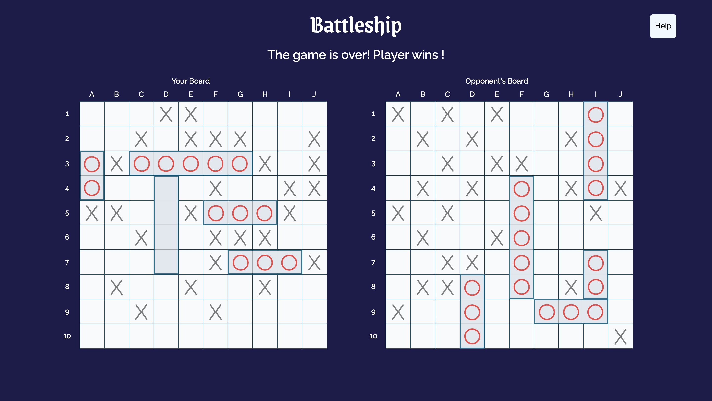

<a id="top"></a>

<div align="center">
    <a href="https://github.com/NestorNebula/battleship">
        
    </a>
    
<h3>Battleship</h3>
</div>

## About



This project is my own version of the classic 'Battleship' game.

If you don't know the game's rules, you can find them [here](<https://en.wikipedia.org/wiki/Battleship_(game)>). You can also find help in the app by clicking on 'Help'.

The player can place five ships one by one or click on a button to place them randomly.

The player plays first and can attack one of the computer's board square. It will then be the computer's turn and so on.

A player must have sunk (i.e. attacking all the squares where a ship is placed) all of his opponent's ships to be considered as the winner.

Once a player has won, the game stops and the winner is declared.

The Computer has a beginner level.

It plays randomly until it hits a ship. It will then search around the square to find the ship's direction and to sink it.
Once the ship is sunk, it restarts the same process.

### Built With


[](https://babeljs.io/)
[](https://jestjs.io/)

## Getting Started

### Prerequisites

- NPM

### Installation

1. Fork the [Project repository](https://github.com/NestorNebula/battleship)
2. Clone the forked repository to your local machine
   ```
   git clone git@github.com:<your username>/<repo name>.git
   ```
3. Update remote URL

   ```
   # SSH:
   git remote add upstream git@github.com:battleship/<repo name>.git

   # HTTPS:
   git remote add upstream https://github.com/battleship/<repo name>.git
   ```

4. Install required packages
   ```
   npm install
   ```
5. Open the app in development mode
   ```
   npm start
   ```

If an error occurs, make sure you have done everything properly according to this guide. If you think so, you can <a href="https://github.com/NestorNebula/battleship/issues">Open an Issue</a>.

## Usage

Once the app is running you should be able to start to play the game locally.

## Contributing

If you find an issue within the app or want to contribute, you can <a href="https://github.com/NestorNebula/battleship/issues">Open an Issue</a>.

## License

[](https://github.com/NestorNebula/battleship/blob/main/LICENSE)

## Contact

Noa Houssier - [Github](https://github.com/NestorNebula)

## Acknoledgements

- [Material Design Icons](https://pictogrammers.com/library/mdi/)

<p align='right'>(<a href='#top'>go back to the top</a>)</p>
